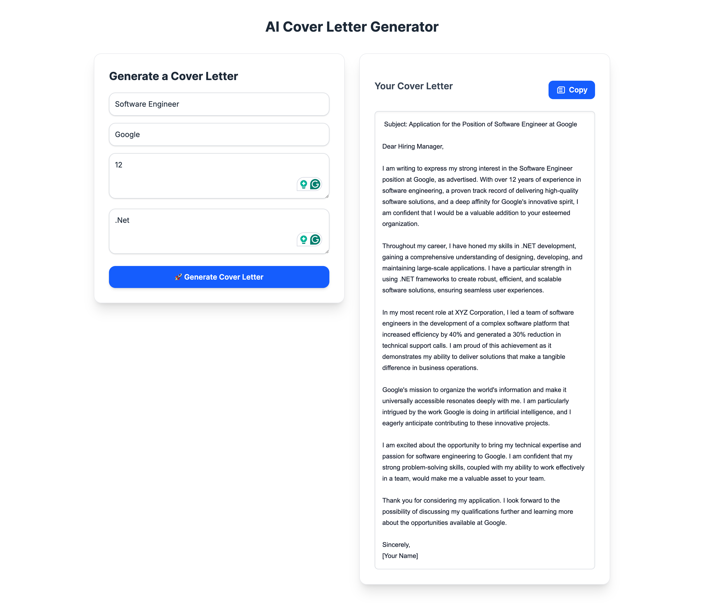

# AI Cover Letter Generator

A modern React & Next.js application to generate AI-powered cover letters based on your job details and experience. Built with React Query for data fetching, Tailwind CSS for styling, and integrates with AI APIs securely using environment variables.

---

## Live Demo

[Click here to view the live demo](https://ai-cover-letter-generator.vercel.app/)
---



---

## Features

- Responsive two-column layout: form on the left, generated cover letter on the right  
- Real-time form state management with Redux  
- AI-powered cover letter generation via external API  
- Copy cover letter text with a sleek button  
- Environment variables support for API keys  
- Tailwind CSS for beautiful and customizable UI  
- React Query for mutation and async API handling

---

## Tech Stack

- [Next.js](https://nextjs.org/)  
- [React Query](https://tanstack.com/query/latest)  
- [Tailwind CSS](https://tailwindcss.com/)  
- [Redux Toolkit](https://redux-toolkit.js.org/)  
- [Axios](https://axios-http.com/)  

---

## Getting Started

### Prerequisites

- Node.js >= 16  
- npm or yarn


### Installation

1. Clone the repository:
```bash
git clone https://github.com/rizwanbinnawaz/ai-cover-letter-generator.git
cd ai-cover-letter-generator
```

2. Install dependencies:
```bash
npm install
```

3. Run project:
```bash
npm run dev
```

4. build project:
```bash
npm run build
```

Open [http://localhost:3000](http://localhost:3000) with your browser to see the result.


---

### Author Details:
```bash
**Muhammad Rizwan** 

Email: rizwanbinnawaz@gmail.com

Phone: +971525571270

Senior Developer | React | Next.js  

Based in Dubai
```
